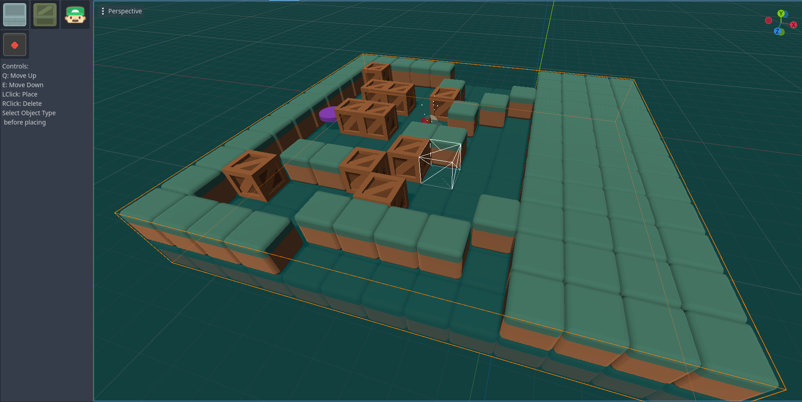
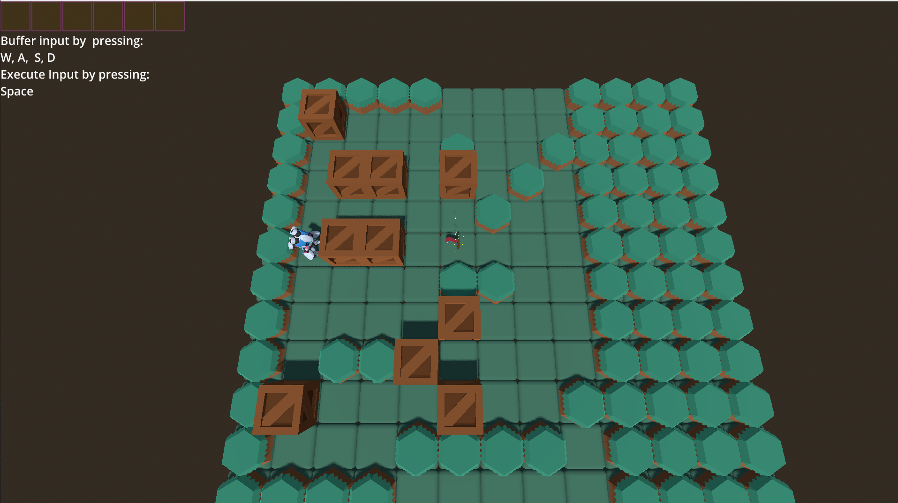
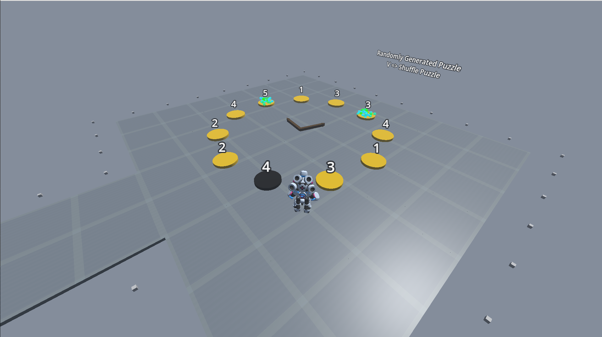

- [Project](#Project)

<!---  -->
|Editor | Ingame |
|---|----|
| | |

# Project

This project implements a in editor puzzle/grid editor which can be seen in *./addons/puzzle_editor*. Placable _scenes_ with their editor icon can be set in *settings.h*. 

New game objects must derive from Puzzle_Object.

Levels in scenes/levels are being automatically loaded and they must derive from Puzzle_Editor.
